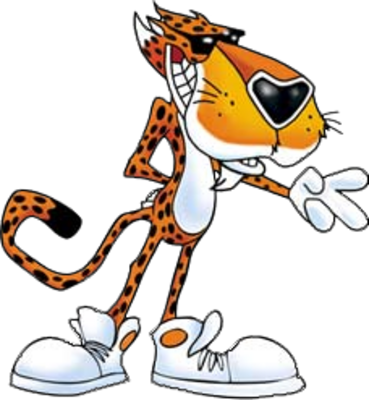

# Tril3ro framework

This project is an attempt to propose an easy and useful cheating framework written in GoLang.

The main objective of the project is to learn, and have fun not to cheat playing videogames.
